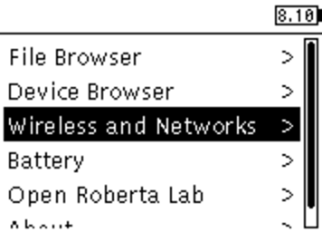
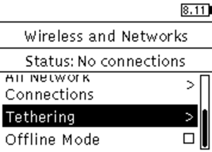
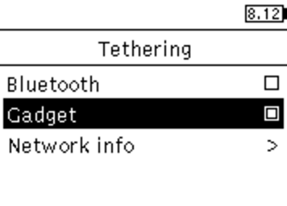
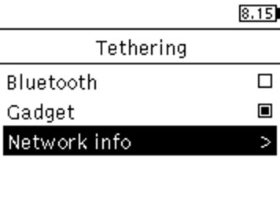
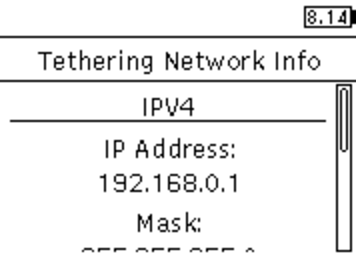

Welcome to the world of LEGO Mindstorms EV3! Work together with your teammates to create the best robot and impress everyone.

## Preliminaries

This mission will be done in groups of 3 or 4 students (depending on the size of your Studio group). Only one person needs to submit the group's programs on the Source Academy, with their group name and members written in a comment at the top of the submission. Other members should submit their group name and members only, but need not submit their programs.

During your teamwork, please follow the **No-Sponge Rule**: _in intra-team collaboration where the group, as a whole, produces a single product, each member of the team must actively contribute._ Usually, everyone in the group will get the same grade. However, the teaching staff may adjust the grade if we find team members who do not contribute actively.

As this project requires a fair amount of time and effort, you are encouraged to start working on it as soon as possible! This may also be your first time to write programs for real hardware (i.e., the LEGO EV3). Hardware is supposed to be _literally_ harder than software (and that may be the reason why people call it hardware). To become a good robotic programmer, you have to think in the hardware way.

You are also recommended to perform sufficient testing, as your program often behaves differently when it is running on the real hardware (i.e., the LEGO EV3) rather than your computer. It is essential for you to understand that your program may be affected by the constraints from the physical environment. For instance, think about a few questions: will the battery level affect the motors? Will the lighting in the room affect the values read from the light sensors? Will surface roughness affect the speed?

In order to complete this project, please follow the steps as follows:

1. [Kit checkout](#1-kit-checkout)
2. [Environment set up](#2-environment-set-up)
3. [Writing and testing your solutions](#3-writing-and-testing-your-solutions)
4. [Assessment](#4-assessment)
5. [Kit return](#5-kit-return)

## 1. Kit checkout

Only one robot kit will be loaned to each group. Each robot kit consists of two boxes, one basic set and one extension set.

On Thursday, 3 Oct 2019, instead of Reflection sessions, you will get started on robotics:

* Form a Telegram robot group for your robot team and include your Avenger in the group.
* Pick up the kit between 10am and 5pm (on 3 Oct 2019) from the Fabrication Lab in COM2-04-23 (Level 4).
* Follow the instructions below to get your robot to move.
* Post evidence in your Telegram robot group to get Reflection attendance taken by your Avenger. There is no Reflection session meeting on 3 Oct 2019. You can meet your robot team anywhere, including in cyberspace.

## 2. Environment set up

### Hardware setup

Instructions for a default robot design are included in the manual, which can be found in the robot kit. Try that out if you don't know where to start. You are, however, encouraged to come up with your own design!

For the mission, it must be a robot that your group has built. Sharing of the same robot for grading, no matter using the same program or different programs, is strictly **NOT** allowed.

#### Installing the ev3dev image

Download the [Source Academy's customised ev3dev image from here](https://github.com/source-academy/ev3-source/releases/download/v0a/ev3-source.img.zip). Then, use an image burner of your choice to install the image onto the microSD card issued. You will require a microSD card reader for this. The instructions for each operating system are as follows:

##### Cross-platform

Follow [this section &#40;"Flash the SD card"&#41; on the ev3dev site](https://www.ev3dev.org/docs/getting-started/#step-2-flash-the-sd-card). **Note: download the [customised EV3-Source image](https://github.com/source-academy/ev3-source/releases/download/v0a/ev3-source.img.zip), not the ev3dev release image.**

If this does not work, try our [alternative instructions at the end of the page](#appendix-alternative-flashing-instructions).

### Software setup

The environment that we have installed in the microSD card is a Linux distribution from a project called [ev3dev](http://www.ev3dev.org/). You can find out more about it from [the official website](http://www.ev3dev.org/). Your solutions will be run in Source running on the [NodeJS](https://nodejs.org/) environment running in ev3dev. Your microSD card has already been formatted with the distro that includes `ev3dev-lang-js`, which supports Source §3, including the list and streams library and the `ev3_XXX` functions listed in the Section "Source Language" below.

This is what you should see when the EV3 has booted up with the microSD card inserted.


Tip: the number you see at the top-right of the screen is the battery voltage in volts. A fully charged battery should read somewhere around 8.3 V, and below 6 V, your battery will be running flat soon.

## 3. Writing and testing your solutions

#### Introduction

To program on the EV3, we will be using the SSH protocol to remotely access the Linux distribution on the EV3. Before you can SSH into your EV3, it has to be connected in some way for it to be remotely accessible.

### How to connect

The EV3 can be connected via a Bluetooth or wired connection. However, we have had most success on the **wired connection** and we highly recommend connecting via the USB wire provided in your kit.

To connect to your EV3 via the USB wire provided, you can follow the instructions from [here](https://www.ev3dev.org/docs/tutorials/connecting-to-the-internet-via-usb/). If this does not work, try [this alternative method](#appendix-alternative-tethering-method).

After that, you can SSH to your EV3 by

```bash
ssh robot@ev3dev.local
```

Enter your password when prompted. The default password is `maker`.

If that does not work, try

```bash
ssh robot@192.168.0.1
```

where `192.168.0.1` is the address shown at the top-left of the EV3.

If you are on Linux or macOS, you should have an SSH client already installed. Windows 10 includes an SSH client from version 1803 onwards. On older versions of Windows, you can use other SSH clients like [PuTTY](http://www.putty.org/). The username is `robot`, and the hostname is `ev3dev.local`, or the IP address shown on the top-left of the EV3 screen, if that does not work.

#### Troubleshooting

For macOS users, if you are running El Capitan (OS X 10.11) or higher, you might not see 'CDC Composite Gadget' in the interfaces list under network configuration. You can try to connect via Bluetooth instead; a tutorial can be found [here](https://www.ev3dev.org/docs/tutorials/connecting-to-the-internet-via-bluetooth/).

### How to write programs

You can write your programs on your computer and then transfer them to the EV3 by

```bash
# (on your local computer)
# (note, the colon at the end is required)
$ scp myprogram.js robot@ev3dev.local:
```

You can also use other SCP clients like [WinSCP](https://winscp.net/eng/download.php).

Alternatively, you can just use `nano` or `vim` via SSH on the EV3 itself. Be sure to keep frequent backups, though.

To run a program that you have written, execute

```bash
# (via SSH, on the EV3)
$ source3 myprogram.js
```

It may take about 10 seconds to load each time you execute the program.

### Examples

#### example1.js

```javascript
const motorA = ev3_motorA();
const motorB = ev3_motorB();

if (ev3_connected(motorA)) {
    display("CONNECTED");
}

if (ev3_connected(motorB)) {
    display("CONNECTED B");
}

ev3_runForDistance(motorA, 3000, 100);
ev3_runForDistance(motorB, -2000, 100);
```

#### example2.js

```jsx
const color = ev3_colorSensor();
if (ev3_reflectedLightIntensity(color) > 20) {
    // Do something
} else {
    // Do something else
}
```

### Source language

The language for this mission is Source §3 (including the list, streams and arrays library), plus the following functions from `ev3`. You may use the listing below as reference when you are working on this mission:

Motors:

- `ev3_motorA()`: returns the motor connected to the port A.
- `ev3_motorB()`: returns the motor connected to the port B.
- `ev3_motorC()`: returns the motor connected to the port C.
- `ev3_motorD()`: returns the motor connected to the port D.
- `ev3_runForDistance(motor, rotations, speed)`: causes the motor (which you get from the previous functions) to rotate at the specified speed for a specific number of rotations; if you pass a negative number of rotations, the motor will rotate backward. The speed is measured in tacho counts per second.
- `ev3_runForTime(motor, time, speed)`: causes the motor (which you get from the previous functions) to rotate at the specified speed for a specific duration (in milliseconds). The speed is measured in tacho counts per second.
- `ev3_stop(motor)`: cause the motor (which you get from the previous functions) to stop rotating.

Note: `ev3_runForDistance` and `ev3_runForTime` work by sending instructions to the motors. They will return almost immediately, without waiting for the motor to actually run for the specified time or distance. If you wish to wait, use `ev3_pause`, documented below.

Color sensor

- `ev3_colorSensor()`: returns the connected color sensor.
- `ev3_colorSensorRed(colorSensor)`: returns the red value read from the `colorSensor` which is a number within the range of 0 to 1020.
- `ev3_colorSensorGreen(colorSensor)`: returns the green value read from the `colorSensor` which is a number within the range of 0 to 1020.
- `ev3_colorSensorBlue(colorSensor)`: returns the blue value read from the `colorSensor` which is a number within the range of 0 to 1020.
- `ev3_reflectedLightIntensity(colorSensor)`: return the percentage of the reflected light intensity.

Touch sensor

- `ev3_touchSensor1()`: returns the touch sensor connected to the port 1.
- `ev3_touchSensor2()`: returns the touch sensor connected to the port 2.
- `ev3_touchSensorPressed(touchSensor)`: returns a value based on the amount of pressure detected by the touch sensor.

Ultrasonic sensor

- `ev3_ultrasonicSensor()`: returns the connected ultrasonic sensor.
- `ev3_ultrasonicSensorDistance(ultrasonicSensor)`: returns the distance between the sensor and an object in centimeters (cm).

Gyro sensor

- `ev3_gyroSensor()`: returns the connected gyro sensor.
- `ev3_gyroSensorRate(gyroSensor)`: Returns the value of the gyro sensor.

Miscellaneous

- `ev3_pause(time)`: Pauses the program for a specified amount of time in milliseconds.
- `ev3_runUntil(terminatingCondition, task)`: repeatedly executes `task()` until `terminatingCondition()` is satisfied; note that both of the two arguments are **functions**.

Part of the fun is learning how to troubleshoot. If you have difficulties, start by googling your problems. For debugging, you can use the `display` function in your programs. The output of `display` will then appear on your screen.

## 4. Assessment

Once you have built your robot, you will need to test it to make sure that it works. This mission consists of **four** tasks, which will prepare your team for the climax of this series of assignments: the Sumobot contest!

Refer to the Mission on Source Academy for the tasks.

### Submission

Submit your programs for all tasks by the deadline specified on Source Academy. Only one member of the team needs to upload the program. All other members should still submit the mission, however, so that your Avenger can assign you the grade.

As part of the submission process, you will be required to demonstrate your robot in front of your Avenger. This will be done during _during Week 8 Studio (7 October or 8 October)_. The Avenger will update and finalize your grade after the completion of your demo. The tracks for task 3 and 4 will be available for demo purposes outside SR1 over the period of this mission.

## 5. Kit return

The robot should be returned _during Week 10 Studio (21 October or 22 October)_. (This may change; please look out for any announcements on this.)

Please make sure all parts in the inventory list are present in the box. You will be asked to do an inventory check before the return. To make this easier, please arrange the parts into the parts organiser in each box according to the diagram on the cardboard cover. **Also, make sure you have erased all the data on the SD card. To make it easier, you should just format the card.**

Have fun!

## Appendix: Alternative flashing instructions

### Windows

- Download the Win32DiskImager software from [Sourceforge](https://sourceforge.net/projects/win32diskimager/files/Archive/Win32DiskImager-1.0.0-binary.zip/download).
- You should get a zip file named "Win32DiskImager-1.0.0-binary.zip".
- Unzip it and now you have a new folder called "Win32DiskImager-1.0.0-binary".
- If your computer has a slot for micro SD cards, insert the card. If not, insert the card into an SD card reader, then connect the reader to your computer.
- Run the file named **Win32DiskImager.exe** (in Windows Vista and higher, you may need to right-click this file and choose "Run as administrator").
- If the micro SD card (Device) you are using is not found automatically, then click on the drop down box on the right and select the micro SD card letter you just plugged in (e.g. [H:]).
- Be careful to select the correct drive; if you get the wrong one, you can destroy your data on your computer’s hard disk!
- In the Image File box, choose the `.img` file that you downloaded and click "Write". _Note: if a warning message appears, click YES._
- Your microSD card is ready to be used.

_Instructions adapted from [udoo](https://www.udoo.org/docs-neo/Getting_Started/Create_a_bootable_MicroSD_card_for_UDOO_Neo.html)_

### macOS

For macOS users, we recommend [Etcher](https://etcher.io/). Otherwise, refer to the Linux instructions to format your microSD card using the command line.

### Linux

0.  Unzip the `ev3-source.img.zip` downloaded earlier to get `ev3-source.img`.

        $ unzip ev3-source.img.zip
        Archive:  ev3-source.img.zip
          inflating: ev3-source.img

1.  Make sure that you SD card is **unplugged**. Then run `df`. You should see
    something like this:

        $ df -h
        Filesystem      Size  Used Avail Use% Mounted on
        /dev/sda1       119G   79G   34G  70% /
        none            4.0K     0  4.0K   0% /sys/fs/cgroup
        udev            7.8G   12K  7.8G   1% /dev
        tmpfs           1.6G  1.1M  1.6G   1% /run
        none            5.0M     0  5.0M   0% /run/lock
        none            7.9G  1.5M  7.9G   1% /run/shm
        none            100M  3.7M   97M   4% /run/user

2.  Now insert your SD card and run `df` again. See the new entry (`/dev/sdb1`)?
    That is your SD card. `sdb` is the actual device name and `1` is the
    partition number. Your actual device may be named something different.

        $ df -h
        Filesystem      Size  Used Avail Use% Mounted on
        /dev/sda1       119G   79G   34G  70% /
        none            4.0K     0  4.0K   0% /sys/fs/cgroup
        udev            7.8G   12K  7.8G   1% /dev
        tmpfs           1.6G  1.1M  1.6G   1% /run
        none            5.0M     0  5.0M   0% /run/lock
        none            7.9G  1.5M  7.9G   1% /run/shm
        none            100M  3.7M   97M   4% /run/user
        /dev/sdb1       2.0G  0.0G  2.0G   0% /media/user/LABEL

3.  Unmount your SD card. If it has more than one partition, you will need to
    do this for each partition.

        $ sudo umount /dev/sdb1

4.  This is the dangerous part. If you pick the wrong device, you could wipe
    out your hard drive, so BE CAREFUL!! When specifying the device, don't
    include the partition number.

    In this example we downloaded the compressed disk image file to
    `~/Downloads/` and our SD card is `/dev/sdb`. Adjust these values as
    needed. This will take a while.

        $ sudo dd if=~/Downloads/ev3-source.img of=/dev/sdb bs=4M \
              oflag=direct status=progress
        [sudo] password for user:

5.  When copying the image file has completed, run

        $ sync

    to make sure any cached disk writes have completed. Once `sync` is finished,
    it is safe to remove the SD card.

Adapted from [the ev3dev website](https://www.ev3dev.org/docs/tutorials/writing-sd-card-image-linux-command-line/).

## Appendix: Alternative tethering method

1.  Enable gadget tethering on the EV3:

    

    

    

2.  Go to the "Network Info" page to find the IP address.

    

    
